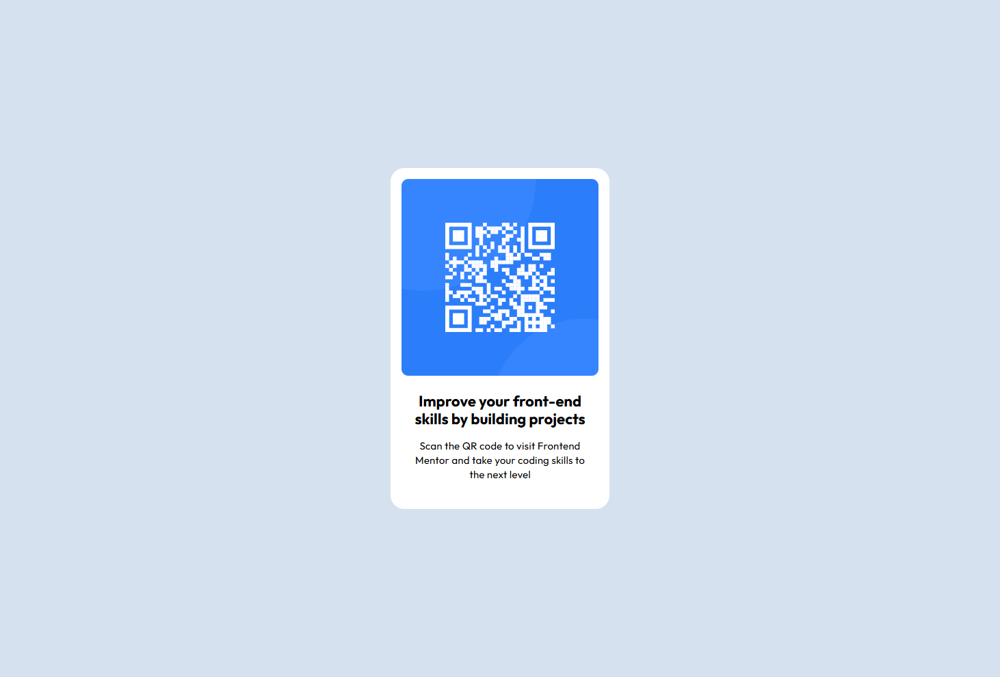

# Frontend Mentor - QR code component solution

This is a solution to the [QR code component challenge on Frontend Mentor](https://www.frontendmentor.io/challenges/qr-code-component-iux_sIO_H). Frontend Mentor challenges help you improve your coding skills by building realistic projects. 

## Table of contents

- [Overview](#overview)
  - [Screenshot](#screenshot)
  - [Links](#links)
- [My process](#my-process)
  - [Built with](#built-with)
  - [What I learned](#what-i-learned)
  - [AI Collaboration](#ai-collaboration)

## Overview

### Screenshot



### Links

- Solution URL: [https://github.com/mohsintahiri/Qr-Code-Component](https://your-solution-url.com)
- Live Site URL: [https://github.com/mohsintahiri/Qr-Code-Component](https://qr-code-component-hazel-nine.vercel.app/)

## My process

I first started creating the different html elements and after that i started styling them starting from the outer part until the secondary text.

### Built with

- Semantic HTML5 markup
- CSS custom properties
- Flexbox

### What I learned

I learned how to make a component keep a fixed height and width whithout addapting to the box created by the content and that is by setting the box-sizing property to:

```css
{
  box-sizing: content-box;
}
```

### AI Collaboration

I used AI to help me fix an issue that i was having related to the height and width of the QR container, i didnt configure the box sizing correctly so the box was taking the one of the content but after asking AI to give me a clue i found out that the solution was to set:
```css
{
  box-sizing: content-box;
}
```